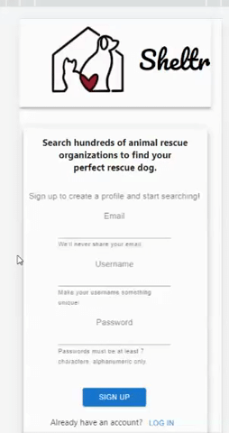
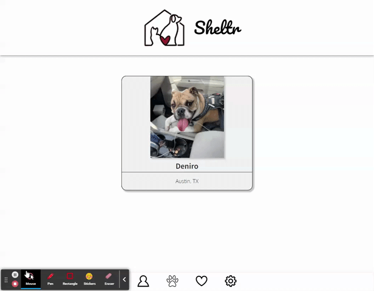
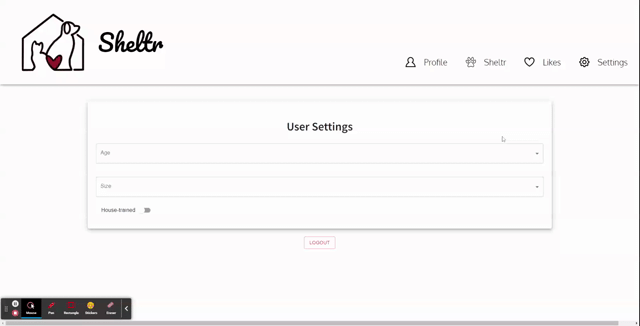

# Sheltr - A mobile first app for finding your next rescue dog

 ---
Version 1.0\
Deployment: Dec 8, 2021\
License: \
  

## Description

Sheltr is a React based mobile first app that allows users to find their next rescue dog. Using the Petfinder API, Sheltr will search for dogs in the area and display them in a list. Users can then swipe left or right to see more information about the dog. Users can also save a dog to their favorites list and view their saved dogs.

## Table of Contents:
- [Walkthrough](https://github.com/echo1826/sheltr#usage)
- [Deployed App](https://github.com/echo1826/sheltr#deployed-app)
- [Tech Stack](https://github.com/echo1826/sheltr#tech-stack)
- [Contributors](https://github.com/echo1826/sheltr#contributors)
- [Questions](https://github.com/echo1826/sheltr#questions)

## Walkthrough

### Login Settings
User can create a profile through signup page or login with their account. \

### Profile
User is taken to their profile page which displays their information and a truncated list of their saved dogs.\

### Sheltr Cards
User can swipe left to dismiss the card or swipe right to save the dog to their likes list.\

### Liked Dogs
User can save a dog to their favorites list and view their saved dogs.\

### User Settings
User can change their search parameters and logout from the app. \

## Deployed App

## Tech Stack
 > * MongoDB
 > * Express.js
 > * React
 > * Node.js
 > * MUI Component Library

 ## Contributors
> * Chuck Stephens [https://github.com/chuck2076](https://github.com/chuck2076)
> * Sue Lee [https://github.com/suelee0308](https://github.com/suelee0308)
> * Ethan Cho [https://github.com/echo1826](https://github.com/echo1826)
> * Mat Lundin [https://github.com/mat-lundin](https://github.com/mat-lundin)
> * Phillip Welch [https://github.com/PAW6063](https://github.com/PAW6063)

## Questions:
Ethan Cho 
 [https://github.com/echo1826](https://github.com/echo1826) 

Feel free to get in touch! 
 [ethan.cho1826@gmail.com](mailto:ethan.cho1826@gmail.com)
